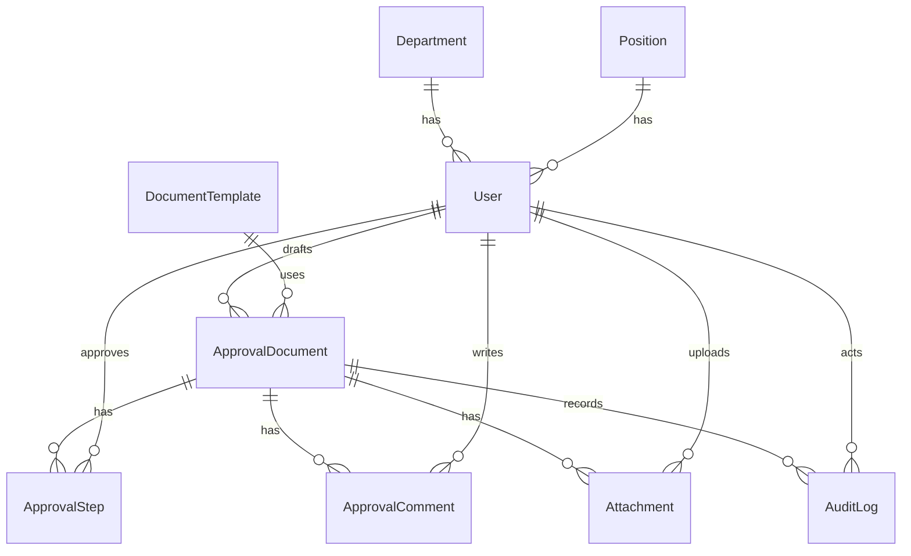
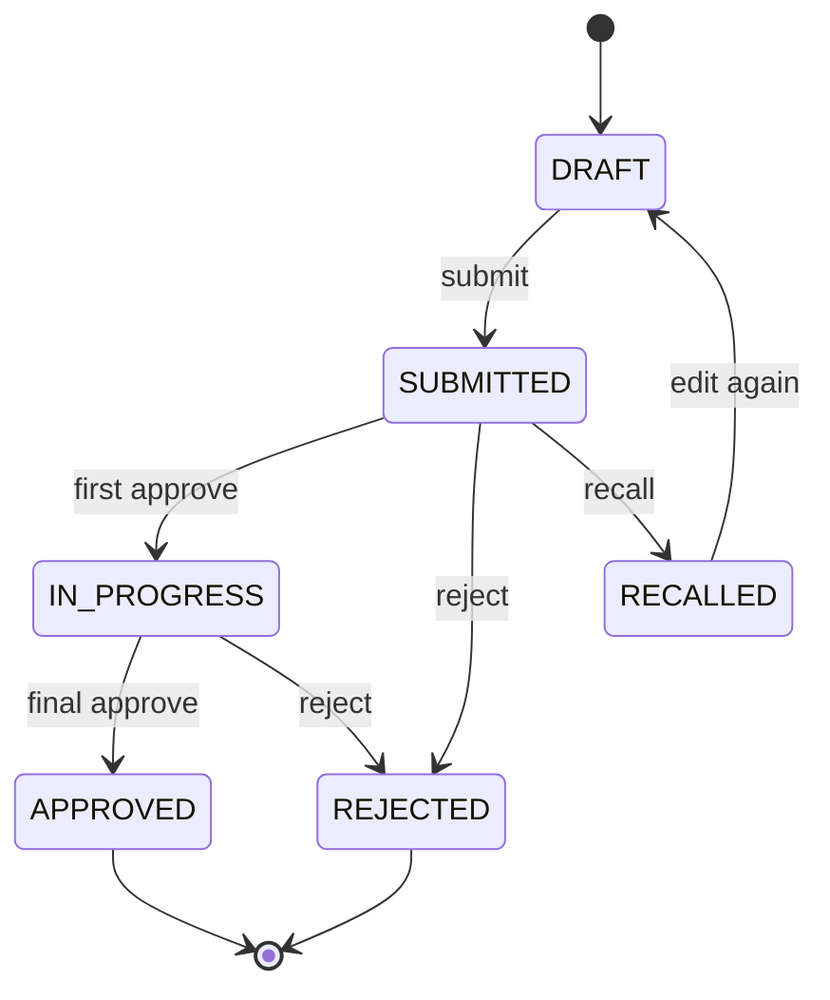

# 데이터 모델 설계

이 문서는 결재온의 DB 설계를 위한 초안이다. 다음 단계에서 Prisma schema로 옮기는 것을 전제로 모델명, 필드명, 상태값을 정리한다.

## 설계 원칙

- 문서 본문과 결재 이력은 삭제보다 상태 변경으로 관리한다.
- 결재선은 문서마다 복사해서 저장한다. 사용자의 직급이나 부서가 바뀌어도 이미 결재 요청된 문서의 당시 결재선이 보존되어야 한다.
- 승인, 반려, 회수 같은 주요 행위는 AuditLog에 남긴다.
- 첨부파일은 로컬 개발 저장소와 Vercel Blob 운영 저장소를 구분해 메타데이터를 남긴다.
- 승인완료, 반려, 회수 문서는 처리일 기준 5년 뒤 보관 검토 대상으로 표시하며 자동 삭제하지 않는다.

## ERD 초안



## Enum

### UserRole

- USER: 일반 사용자
- ADMIN: 관리자

### UserStatus

- ACTIVE: 사용 중
- INACTIVE: 비활성

### DocumentStatus

- DRAFT: 임시저장
- SUBMITTED: 결재 요청
- IN_PROGRESS: 진행중
- APPROVED: 승인완료
- REJECTED: 반려
- RECALLED: 회수

### ApprovalStepStatus

- WAITING: 이전 결재자를 기다리는 상태
- PENDING: 현재 결재자가 처리해야 하는 상태
- APPROVED: 승인
- REJECTED: 반려
- SKIPPED: 정책상 건너뜀

### AuditAction

- CREATE_DRAFT: 임시저장
- UPDATE_DRAFT: 임시저장 수정
- SUBMIT: 결재 요청
- APPROVE: 승인
- REJECT: 반려
- RECALL: 회수
- COMPLETE: 최종 승인완료
- CREATE_USER: 사용자 생성
- UPDATE_USER: 사용자 수정
- CREATE_TEMPLATE: 문서 양식 생성
- UPDATE_TEMPLATE: 문서 양식 수정

## 모델

### User

사용자 계정과 조직 정보를 담는다.

| 필드 | 타입 | 필수 | 설명 |
| --- | --- | --- | --- |
| id | string | Y | 사용자 ID |
| name | string | Y | 사용자 이름 |
| email | string | N | 연락 이메일, unique |
| passwordHash | string | N | 자체 로그인 사용 시 저장 |
| departmentId | string | Y | Department 참조 |
| positionId | string | Y | Position 참조 |
| role | UserRole | Y | USER 또는 ADMIN |
| status | UserStatus | Y | ACTIVE 또는 INACTIVE |
| profileImageStorageProvider | string | N | 프로필 이미지 저장소 종류 |
| profileImageStorageKey | string | N | 프로필 이미지 저장소 키 |
| profileImageMimeType | string | N | 프로필 이미지 MIME 타입 |
| profileImageSize | number | N | 프로필 이미지 파일 크기 |
| profileImageUpdatedAt | datetime | N | 프로필 이미지 변경일 |
| createdAt | datetime | Y | 생성일 |
| updatedAt | datetime | Y | 수정일 |

관계:

- Department 1개에 속한다.
- Position 1개를 가진다.
- 여러 문서를 작성할 수 있다.
- 여러 결재 단계의 결재자가 될 수 있다.

### Department

부서 기준 정보다.

| 필드 | 타입 | 필수 | 설명 |
| --- | --- | --- | --- |
| id | string | Y | 부서 ID |
| name | string | Y | 부서명 |
| code | string | Y | 부서 코드, unique |
| parentId | string | N | 상위 부서 ID |
| sortOrder | number | Y | 정렬 순서 |
| isActive | boolean | Y | 사용 여부 |
| createdAt | datetime | Y | 생성일 |
| updatedAt | datetime | Y | 수정일 |

관계:

- 여러 User를 가진다.
- parentId로 부서 계층을 표현할 수 있다.

### Position

직급 또는 직책 기준 정보다.

| 필드 | 타입 | 필수 | 설명 |
| --- | --- | --- | --- |
| id | string | Y | 직급 ID |
| name | string | Y | 직급명 |
| level | number | Y | 직급 레벨 |
| sortOrder | number | Y | 정렬 순서 |
| isActive | boolean | Y | 사용 여부 |
| createdAt | datetime | Y | 생성일 |
| updatedAt | datetime | Y | 수정일 |

관계:

- 여러 User가 같은 Position을 가질 수 있다.

### DocumentTemplate

문서 양식 기준 정보다. MVP에서는 일반 기안서 1개로 시작한다.

| 필드 | 타입 | 필수 | 설명 |
| --- | --- | --- | --- |
| id | string | Y | 양식 ID |
| name | string | Y | 양식명 |
| description | string | N | 설명 |
| schema | json | Y | 입력 필드 구조 |
| isActive | boolean | Y | 사용 여부 |
| createdAt | datetime | Y | 생성일 |
| updatedAt | datetime | Y | 수정일 |

관계:

- 여러 ApprovalDocument에서 사용된다.

### ApprovalDocument

결재 문서 본문과 상태를 담는 핵심 모델이다.

| 필드 | 타입 | 필수 | 설명 |
| --- | --- | --- | --- |
| id | string | Y | 문서 ID |
| documentNo | string | Y | 문서 번호, unique |
| title | string | Y | 제목 |
| category | string | Y | 문서 분류 |
| content | string | Y | 기안 내용 |
| status | DocumentStatus | Y | 문서 상태 |
| templateId | string | Y | DocumentTemplate 참조 |
| drafterId | string | Y | 작성자 User 참조 |
| submittedAt | datetime | N | 결재 요청일 |
| completedAt | datetime | N | 승인완료 또는 반려일 |
| createdAt | datetime | Y | 생성일 |
| updatedAt | datetime | Y | 수정일 |

관계:

- User 1명이 작성한다.
- DocumentTemplate 1개를 사용한다.
- 여러 ApprovalStep, ApprovalComment, Attachment, AuditLog를 가진다.

### ApprovalStep

문서별 결재선이다.

| 필드 | 타입 | 필수 | 설명 |
| --- | --- | --- | --- |
| id | string | Y | 결재 단계 ID |
| documentId | string | Y | ApprovalDocument 참조 |
| approverId | string | Y | 결재자 User 참조 |
| order | number | Y | 결재 순서 |
| status | ApprovalStepStatus | Y | 단계 상태 |
| actedAt | datetime | N | 승인 또는 반려 처리일 |
| comment | string | N | 결재 의견 |
| createdAt | datetime | Y | 생성일 |
| updatedAt | datetime | Y | 수정일 |

제약:

- 같은 documentId 안에서 order는 중복될 수 없다.
- 같은 documentId 안에서 approverId 중복은 MVP에서 허용하지 않는다.
- PENDING 상태는 문서당 최대 1개만 허용한다.

### ApprovalComment

문서 상세의 의견 또는 협의 댓글이다. 승인/반려 의견은 ApprovalStep.comment에 남기고, 일반 댓글은 이 모델에 남긴다.

| 필드 | 타입 | 필수 | 설명 |
| --- | --- | --- | --- |
| id | string | Y | 댓글 ID |
| documentId | string | Y | ApprovalDocument 참조 |
| authorId | string | Y | 작성자 User 참조 |
| body | string | Y | 댓글 내용 |
| createdAt | datetime | Y | 생성일 |
| updatedAt | datetime | Y | 수정일 |

### Attachment

첨부파일 메타데이터다.

| 필드 | 타입 | 필수 | 설명 |
| --- | --- | --- | --- |
| id | string | Y | 첨부파일 ID |
| documentId | string | Y | ApprovalDocument 참조 |
| uploaderId | string | Y | 업로드 User 참조 |
| originalName | string | Y | 원본 파일명 |
| storageProvider | string | Y | 저장소 종류. `local` 또는 `vercel-blob` |
| storageKey | string | Y | 저장소 키 |
| mimeType | string | Y | MIME 타입 |
| size | number | Y | 파일 크기 |
| createdAt | datetime | Y | 업로드일 |

### AuditLog

주요 작업 기록이다. 보안과 추적을 위해 사용자에게 직접 보이는 결재 이력보다 더 넓게 기록한다.

| 필드 | 타입 | 필수 | 설명 |
| --- | --- | --- | --- |
| id | string | Y | 로그 ID |
| actorId | string | Y | 작업자 User 참조 |
| action | AuditAction | Y | 작업 종류 |
| targetType | string | Y | 대상 모델명 |
| targetId | string | Y | 대상 ID |
| documentId | string | N | 문서 관련 로그일 때 참조 |
| message | string | N | 표시용 설명 |
| metadata | json | N | 추가 정보 |
| ipAddress | string | N | 요청 IP |
| userAgent | string | N | 브라우저 정보 |
| createdAt | datetime | Y | 발생일 |

## 화면별 사용 모델

| 화면 | 사용 모델 |
| --- | --- |
| 홈 | ApprovalDocument, ApprovalStep, AuditLog |
| 기안작성 | DocumentTemplate, ApprovalDocument, ApprovalStep, Attachment |
| 받은결재함 | ApprovalDocument, ApprovalStep, User |
| 제출 문서함 | ApprovalDocument, ApprovalStep, User |
| 완료문서함 | ApprovalDocument, ApprovalStep, User |
| 문서 상세 | ApprovalDocument, ApprovalStep, ApprovalComment, Attachment, AuditLog, User |
| 내 계정 | User, Department, Position, AuditLog |
| 관리자 사용자 관리 | User, Department, Position, AuditLog |
| 관리자 양식 관리 | DocumentTemplate, AuditLog |
| 관리자 감사 로그 | AuditLog, User, ApprovalDocument |

## 문서 번호 정책

MVP에서는 아래 형식을 사용한다.

```text
EA-YYYY-NNNN
```

예시:

```text
EA-2026-0007
```

규칙:

- EA는 전자결재 문서 prefix다.
- YYYY는 결재 요청 연도다.
- NNNN은 연도별 증가 번호다.
- 임시저장 상태에서는 문서 번호를 비워둘 수 있다.
- 결재 요청 시점에 문서 번호를 발급한다.

## 결재 상태 전이



## 다음 단계에서 Prisma로 옮길 때 확인할 것

- DB는 PostgreSQL을 사용한다.
- id는 cuid 또는 uuid 중 하나로 통일한다.
- documentNo는 unique index를 둔다.
- ApprovalStep은 documentId와 order에 unique index를 둔다.
- User.email은 unique index를 둔다.
- AuditLog는 수정/삭제하지 않는 append-only 성격으로 다룬다.
