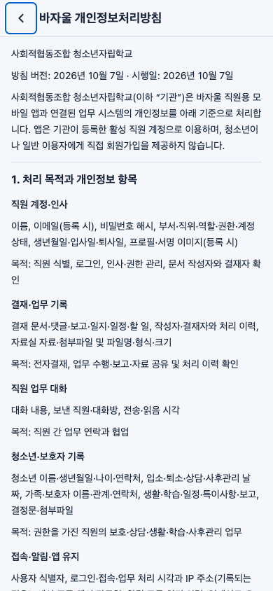
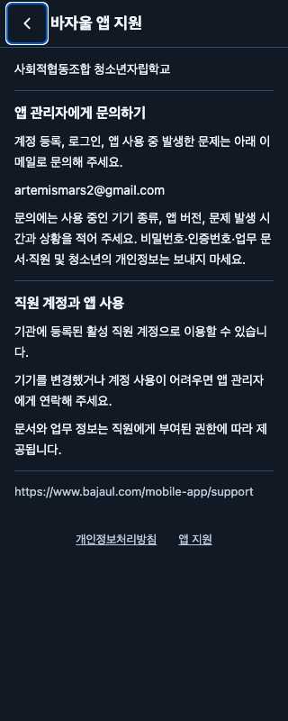

# 공개 안내 화면 검수

개인정보처리방침·앱 지원 링크를 누를 때 외부 브라우저 실행 실패가 발생하던 경로를 앱 내부 공개 화면으로 변경했다. 로그인·내 정보 화면에서 같은 컴포넌트를 사용하며 두 안내 화면은 로그인 보호 그룹 밖에 있다. 기존 공개 웹 페이지를 변경하지 않고 전체 방침 8개 절과 지원 안내를 앱 번들에 포함한다. 직원 API·토큰·기기 브라우저·네트워크를 사용하지 않는다.

내용의 원본은 `src/app/mobile-app/privacy/page.tsx`, `support/page.tsx`, `src/lib/mobile-app-info.ts`다. 수정 후 `node scripts/mobile-public-information.mjs`로 모바일 내용을 갱신한다. 원본과 생성 파일의 불일치는 단위 테스트에서 실패한다. 방침 내용이나 보관 기간을 새로 정하지 않았다.

검수 경로: 로그인 링크 → 개인정보처리방침 → 마지막 절 → 앱 지원. 실제 React Native Web 컴포넌트를 Chrome에서 실행했고, OS·라우터는 테스트 포트다. 로드 후 브라우저 네트워크를 끊은 상태에서도 두 화면을 이동하고 전체 내용을 읽었다. 직원 API 요청은 0건이었다. 기기에서의 네이티브 렌더링은 별도 확인 대상이다.

| 기준 | 첫 화면에서 확인한 정보 | 결과 |
| --- | --- | --- |
| 390×844 라이트 | 뒤로, 방침 제목·시행일·처리 목적과 항목 시작; 지원 제목·문의 이메일·사용 안내 | 가로 넘침 없음 |
| 320×800 다크 | 제목·담당 이메일·문의 시 준비할 정보·계정 안내 | 가로 넘침 없음 |
| 360×800 글자 크기 2배 | 제목·방침 시행일·소개; 본문은 세로 스크롤로 열람 | 가로 넘침·겹침 없음 |
| 1366×768 다크 | 제목·안내 내용; 본문 최대 너비 800px | 가로 넘침 없음 |
| 195×422 (390px의 200% reflow 대응) | 제목·본문·관련 링크, 긴 URL 줄바꿈 | 가로 넘침 없음 |

뒤로 버튼과 관련 링크는 44px 이상이다. 키보드 포커스를 확인했고, 마지막 절·관련 링크까지 스크롤할 수 있었다. 지원 이메일과 참고 URL은 선택하여 복사할 수 있다.

검증: 공개 안내 및 기존 업데이트 안전성 단위 테스트 47개 통과, 브라우저 테스트 15개 통과, 저장소·모바일 lint/typecheck 통과, Android·iOS·웹 export 통과. 테스트 포트에서 기기 브라우저 실행을 호출하지 않는 것을 확인했다.

