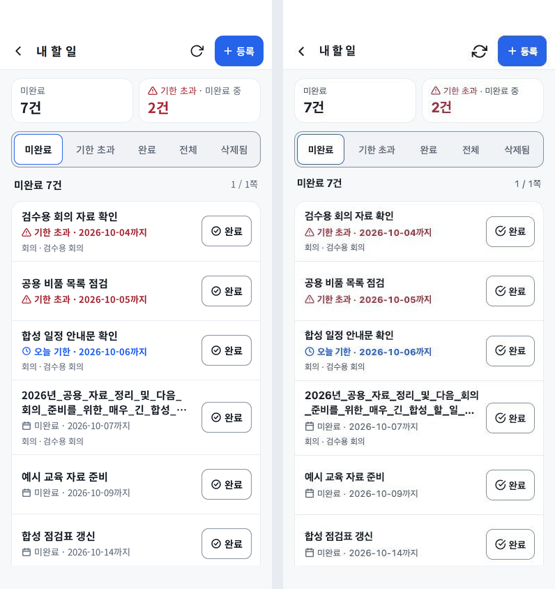
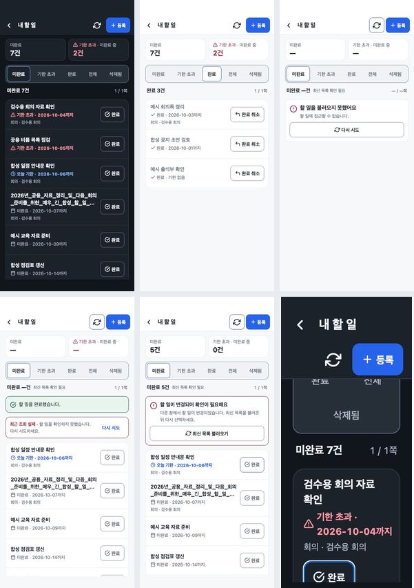

# 내 할 일 목록 v1 — 디자인 검수

2026-10-06. **Final result: passed.** P0/P1/P2 미해결 사항 없음. 실제 production TSX를 실행한 Expo 웹 앱 `/tasks`를 독립적인 합성 API로 검수했다. 운영 직원·업무·계정·DB는 사용하지 않았다.

## 선택한 원본과 구현 비교

Claude ‘바자울 전자결재 앱 디자인’ Version 29, 14번째 페이지 ‘내 할 일 목록 v1’을 구현했다. [브리프](../../mobile-tasks-list-design-brief.md), [기능 계약](../../mobile-tasks-list-design-contract.md). 원본 ZIP SHA-256: `99bdf0dd2fae4b4fdc735807b3c7891505cec298c81d77df743aa0dd418490ae`.

두 이미지는 같은 날짜·제목·회의명·건수·테마·뷰포트로 맞췄다. 원본 PNG의 2배 픽셀 밀도를 390×844로 정규화했다. 원본의 Noto Sans KR은 앱이 사용하는 플랫폼 기본 폰트로 구현했다. 새 폰트·패키지·native 설정·runtime 변경은 없다. 기존 Feather 선형 아이콘과 useHomeTheme 색상을 사용한다.

52px 헤더, 16px 바깥 여백, 12px 구획 간격, 64px 요약, 44px 행동, 둥근 업무 행 그룹을 맞췄다. 완료 취소·미완료의 부분집합인 기한 초과·기한 없는 업무·전체 제목을 담는 접근 이름을 제공한다. 큰 글자에서는 요약과 업무 버튼이 재배치되며 날짜는 한 덩어리로 다음 줄로 이동한다.

## 실제 브라우저 측정

390×844 light/dark, 360×800 light/dark, 1366×768, 360px에 200% 확대와 같은 180px 재배치 후 2배 표시를 확인했다. 확대 모의는 OS 글자 크기 검사가 아니다. 웹 검수 wrapper만 기기 여백을 소유하고 제품은 실제 SafeArea API를 사용한다.

| 기준 | 확인된 결과 |
| --- | --- |
| 첫 행 | 390px에서 고정 헤더 아래 스크롤 영역의 약 26.6%; 360px·1366px도 약 27% |
| 기본 행 | 첫 업무의 상세 터치 영역 85px, 완료 행동 44px |
| 가로 넘침 | 390/360/1366/180px 모두 scrollWidth = clientWidth |
| 조작 영역 | 측정한 활성 화면의 버튼 모두 44×44px 이상 |
| 텍스트 대비 | 실제 RN Web Text의 계산된 색/배경 기준 light/dark 모두 미달 없음, 최저 약 5.17:1 |
| 제목·숫자 | 공백 없는 긴 제목, 1,000,000건·12,345건·50,000쪽, 전체 접근 이름 유지 |
| 키보드 | 등록·완료 버튼 포커스 표시, 확대 상태에서 업무와 완료 행동에 접근 가능 |
| 데스크톱 | 목록·헤더 최대 760px, 중앙 정렬·요약과 업무가 첫 화면에 표시됨 |

[측정 JSON](qa-result.json). 큰 글자 및 안전 안내가 함께 있는 상태에서는 안내와 조작 가능성을 우선하며 40% 밀도 목표의 예외를 적용한다. 200%에서는 스크롤로 업무에 도달할 수 있고, 제목·날짜·완료 행동이 겹치지 않는다.

## 상태와 동작

- 미완료·기한 초과·완료·전체·삭제됨, 기한 없음·선택적 회의명, 47건 목록 2/3쪽 이동을 확인했다. 삭제됨에는 완료·삭제·복구 버튼을 새로 제공하지 않는다.
- 로딩은 요약 —와 목록 형태 스켈레톤, 조회가 확인된 빈 목록은 0건과 등록 진입을 제공한다. 최초 조회 실패는 실제 오류와 GET 재시도를 제공한다.
- GET403/404 회귀 검사에서 이전 행·건수·성공 안내를 제거한다. 실제 Expo GET403에서도 행이 DOM에서 제거됨을 확인했다. GET500은 이전 확인 자료와 명확한 오류를 유지하고 완료 쓰기는 잠근다.
- 완료 요청 중 해당 행에 처리 중을 표시하고 새로고침·등록·필터·다른 완료 및 기존 상세 잠금을 유지한다. 동기 ref가 중복 POST를 차단한다.
- 성공 뒤 목록 조회 실패는 성공 안내와 오류를 함께 유지하고 GET만 재시도한다. 미확정 건수는 —, 새 쓰기는 성공적인 최신 조회 후 해제된다.
- 409 충돌은 자동 덮어쓰기를 하지 않으며 최신 목록 조회 후 다시 선택한다. 확정 실패 재시도는 기존 task/version/completed를 유지한다.
- 실제 등록 폼으로 이동했다. 상세 경로와 기존 상세 화면으로 이동한 것까지 확인했으며 합성 API의 상세 이력 응답은 검수 범위 밖으로 차단했다. 실제 상세 데이터·등록 저장을 검증했다고 주장하지 않는다.

시안과 달리 처리 중 다른 행의 상세 열기는 기존 앱의 잠금을 유지한다. 확정 저장 실패 안내는 기존 화면 단위 피드백 구조를 유지한다. 이는 기능 계약의 기존 보호 규칙을 보존하기 위한 구현 판단이다.

## 자동 검증 및 한계

실제 TasksContent를 실행하는 관련 회귀 13개 통과. 기존 늦은 응답·화면 복귀·계정 변경·원래 version 재시도·충돌·성공 후 GET 실패 검사를 보존했고, GET403/404 캐시 제거와 GET 중복/오래된 완료 콜백 잠금 검사를 추가했다. 루트·모바일 lint/typecheck, 운영 설정 검사, 공식 Android/iOS/web export를 통과했다. 전체 릴리스는 PR 및 main의 CI 통과를 배포 조건으로 삼는다.

이 로컬 Node 22.21.0 환경의 전체 단위 실행은 Next.js 공통 모듈 로더 오류로 시작하지 못했다. 관련 회귀는 통과했으며 별도 깨끗한 CI 환경에서 전체 검사를 요구한다.

실기기 SafeArea, iOS/Android OS 글자 크기, VoiceOver/TalkBack 낭독, 실제 앱 업데이트 적용 후 화면은 직접 검증하지 않았다. 이번 화면은 새 native 기능·권한·서버 계약을 추가하지 않는다.
